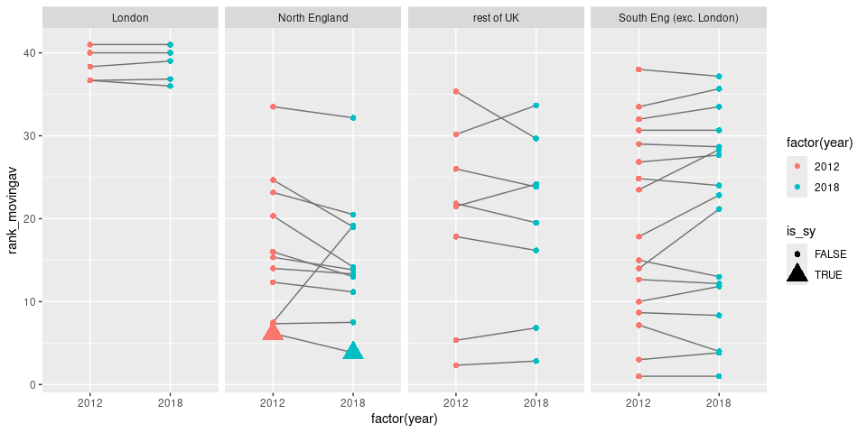

# README

# REGIONAL GVA GAP

``` r
#ONS link to the Excel sheets: https://www.ons.gov.uk/economy/grossdomesticproductgdp/datasets/regionalgrossdomesticproductallnutslevelregions
#Data folder name of downloaded Excel sheets (from which the CSVs below are exported)
#regionalgrossdomesticproductgdpallitlregions.xlsx
perhourworked <- read_csv(here('data/Table A4 Current Price unsmoothed GVA B per hour worked £ ITL2 and ITL3 subregions 2004 to 2021.csv')) %>% 
rename(ITL = `ITL level`, ITLcode = `ITL code`, region = `Region name`) %>% 
  filter(ITL == 'ITL2') %>% 
  pivot_longer(cols = `2004`:`2021`, names_to = 'year', values_to = 'gva') %>% 
  mutate(year = as.numeric(year))

#Repeat for ITL3
perhourworked.itl3 <- read_csv(here('data/Table A4 Current Price unsmoothed GVA B per hour worked £ ITL2 and ITL3 subregions 2004 to 2021.csv')) %>% 
  rename(ITL = `ITL level`, ITLcode = `ITL code`, region = `Region name`) %>% 
  filter(ITL == 'ITL3') %>% 
  pivot_longer(cols = `2004`:`2021`, names_to = 'year', values_to = 'gva') %>% 
  mutate(year = as.numeric(year))


#Rank to see which ITL2 changed position the most
perhourworked <- perhourworked %>% 
  group_by(year) %>% 
  mutate(rank = rank(gva))

#But let's start with 3 year smoothing and check differences
perhourworked <- perhourworked %>% 
  arrange(year) %>% 
  group_by(region) %>%
  mutate(
    movingav = rollapply(gva,3,mean,align='right',fill=NA),
    rank_movingav = rollapply(rank,3,mean,align='right',fill=NA),
    rank_movingav_7yr = rollapply(rank,7,mean,align='right',fill=NA)
    )


#Picking out England and North etc...
#Via https://github.com/DanOlner/regionalGVAbyindustry

#Northern England
north <- perhourworked$region[grepl('Greater Manc|Merseyside|West Y|Cumbria|Cheshire|Lancashire|East Y|North Y|Tees|Northumb|South Y', perhourworked$region, ignore.case = T)] %>% unique

#South England
south <- perhourworked$region[!grepl('Greater Manc|Merseyside|West Y|Cumbria|Cheshire|Lancashire|East Y|North Y|Tees|Northumb|South Y|Scot|Highl|Wales|Ireland', perhourworked$region, ignore.case = T)] %>% unique

#South minus London
south.minus.london <- south[!grepl('london',south,ignore.case = T)]

#England!
england <- c(north,south)

#England minus London
england.minus.london <- england[!grepl('london',england,ignore.case = T)]

#UK minus London
uk.minus.london <- perhourworked$region[!grepl('london',perhourworked$region,ignore.case = T)] %>% unique

#Check is all correct with map
# itl2.geo <- st_read('data/ITL_geographies/International_Territorial_Level_2_January_2021_UK_BFE_V2_2022_-4735199360818908762/ITL2_JAN_2021_UK_BFE_V2.shp') %>% 
#   st_simplify(preserveTopology = T, dTolerance = 100)
# 
# #Tick
# table(england %in% itl2.geo$ITL221NM)
# 
# #Ticks all round
# plot(st_geometry(itl2.geo %>% filter(ITL221NM %in% england)), col = 'grey')
# plot(st_geometry(itl2.geo %>% filter(ITL221NM %in% north)), col = 'blue', add = T)
# plot(st_geometry(itl2.geo %>% filter(ITL221NM %in% south)), col = 'green', add = T)
# plot(st_geometry(itl2.geo %>% filter(ITL221NM %in% england.minus.london)), col = 'red', add = T)
# 
# plot(st_geometry(itl2.geo %>% filter(ITL221NM %in% uk.minus.london)), col = 'grey')


#Add those regions into the per hour worked data
perhourworked <- perhourworked %>% 
  mutate(ns_england_restofUK = case_when(
    region %in% north ~ 'North England',
    region %in% south ~ 'South Eng (inc. London)',
    .default = 'rest of UK'
  ))

table(perhourworked$ns_england_restofUK, useNA = 'always')
```


              North England              rest of UK South Eng (inc. London) 
                        198                     144                     396 
                       <NA> 
                          0 

``` r
perhourworked <- perhourworked %>% 
  mutate(ns_england_restofUK_londonseparate = case_when(
    region %in% north ~ 'North England',
    region %in% south.minus.london ~ 'South Eng (exc. London)',
    grepl('london',region,ignore.case = T) ~ 'London',
    .default = 'rest of UK'
  ))

table(perhourworked$ns_england_restofUK_londonseparate, useNA = 'always')
```


                     London           North England              rest of UK 
                         90                     198                     144 
    South Eng (exc. London)                    <NA> 
                        306                       0 

``` r
#Add marker for South Yorkshire
perhourworked <- perhourworked %>% 
  mutate(is_sy = region == 'South Yorkshire')


#Plot: first coalition years to pre covid
ggplot(perhourworked %>% filter(year %in% c(2012,2018)), aes(x = factor(year), y = rank_movingav, group = region, color = factor(year))) +
  geom_line(aes(group = region), color = "grey44") +
  geom_point(aes(shape = is_sy, size = is_sy)) +
  facet_wrap(vars(ns_england_restofUK_londonseparate), nrow = 1)
```


